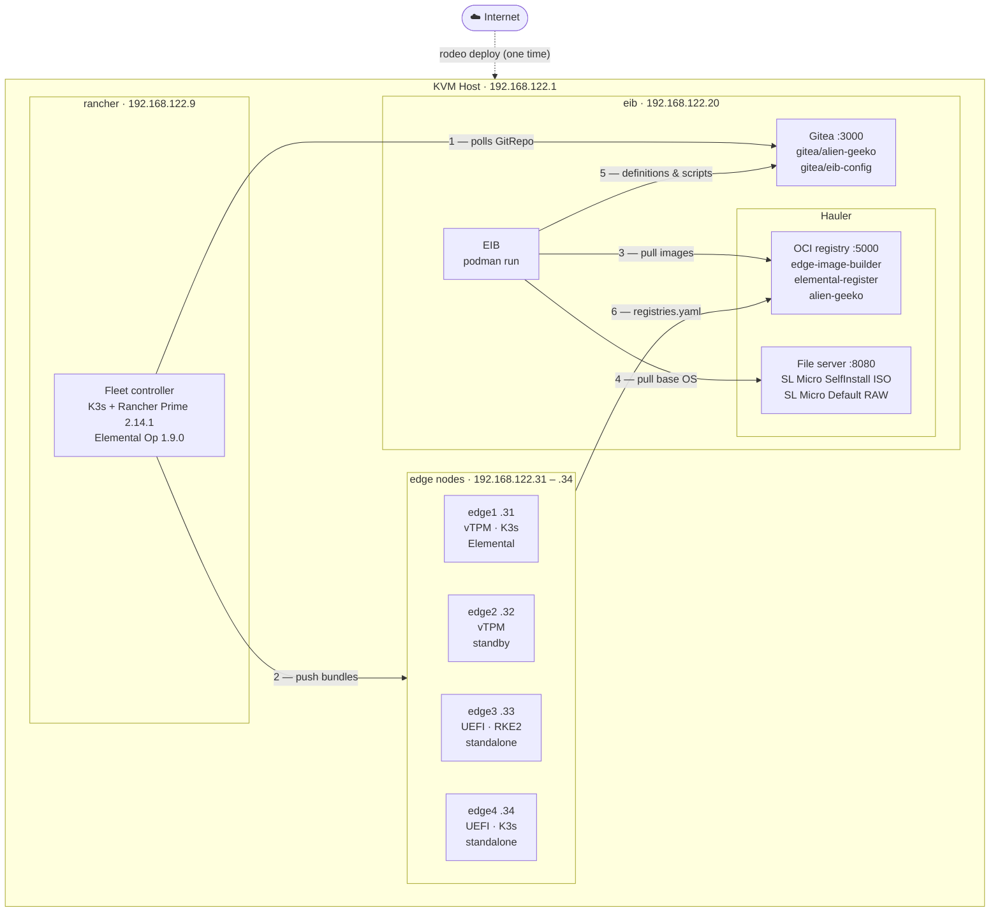

# Disconnected environment reference

This lab is designed to run offline after the initial deploy. This page explains what that means in practice: what was pre-staged, what stays local during exercises, and what would break if internet access were cut.

---

## The two phases

| Phase | Internet needed? | Who runs it |
|---|---|---|
| `rodeo deploy` | Yes — pulls several GB | Instructor, once |
| Lab exercises (01 – 06) | No | Students |

Once `rodeo deploy` completes, the lab network at `192.168.122.0/24` is self-sufficient. Every image, binary, artifact, and Git repo needed for the exercises lives locally on the EIB VM.

---

## Architecture



| Flow | What happens |
|---|---|
| 1 | Fleet controller on rancher VM polls Gitea on eib VM for `alien-geeko` GitRepo changes. All traffic on 192.168.122.0/24. No GitHub access after deploy. |
| 2 | Fleet pushes workload bundles from management cluster to downstream cluster agents on the edge nodes. |
| 3 | EIB pulls container images to embed in OS images from the Hauler OCI registry at :5000. |
| 4 | EIB pulls the SL Micro base OS (ISO or RAW) from the Hauler file server at :8080. |
| 5 | EIB clones the `eib-config` Gitea repo for definition files, NMState network configs, and combustion scripts. |
| 6 | K3s on every edge node has `registries.yaml` baked in by EIB, routing docker.io, registry.suse.com, and ghcr.io through Hauler at :5000. |

---

## What Gitea provides

Gitea is a lightweight open source Git server (MIT license, community-maintained). It is **not** a SUSE Edge product — see the [Hauler bonus lab](bonus-hauler.md) for more background on community tools used in this lab.

Gitea runs on the EIB VM at `http://192.168.122.20:3000`. It holds two repositories:

| Repo | URL | Used by |
|---|---|---|
| `gitea/alien-geeko` | `http://192.168.122.20:3000/gitea/alien-geeko.git` | Fleet GitRepo `alien-geeko` |
| `gitea/eib-config` | `http://192.168.122.20:3000/gitea/eib-config.git` | Students in Exercises 2 and 3 |

`alien-geeko` is mirrored from GitHub once at deploy time. After that, Fleet polls it every 15 seconds. `eib-config` holds the EIB image definition templates, NMState network configs, and combustion scripts that students clone in Exercise 2 and use in Exercise 3.

Verify it is running:

```bash
ssh -i /root/.ssh/id_ed25519 root@192.168.122.20

# Container status
podman ps --filter name=gitea --format "table {{.Names}}\t{{.Status}}\t{{.Ports}}"

# API check
curl -s http://localhost:3000/api/v1/version | python3 -m json.tool

# Both repos exist
curl -s http://localhost:3000/api/v1/repos/gitea/alien-geeko \
  | python3 -c "import sys,json; r=json.load(sys.stdin); print('alien-geeko:', r['full_name'], r['default_branch'])"

curl -s http://localhost:3000/api/v1/repos/gitea/eib-config \
  | python3 -c "import sys,json; r=json.load(sys.stdin); print('eib-config:', r['full_name'], r['default_branch'])"
```

---

## What Hauler stores

Hauler runs on the EIB VM at two endpoints:

**OCI registry — port 5000**

| Image | Source | Used in |
|---|---|---|
| `registry.suse.com/edge/3.6/edge-image-builder:1.3.3.1` | SUSE registry | Exercise 3 — all EIB builds |
| `registry.suse.com/rancher/elemental-register:1.9.0` | SUSE registry | Exercise 3 — Elemental ISO builds |
| `docker.io/avaleror/alien-geeko:latest` | Docker Hub | Exercise 6 — Fleet deploy to edge clusters |

**File server — port 8080**

| File | Used in |
|---|---|
| `SL-Micro.x86_64-6.2-Base-SelfInstall-GM.install.iso` | Exercise 3.1, 3.2 — EIB Elemental ISO base |
| `SL-Micro.x86_64-6.2-Default.raw` | Exercise 3.3, 3.4 — EIB standalone RAW base |

Verify everything is in place:

```bash
ssh -i /root/.ssh/id_ed25519 root@192.168.122.20

# Registry catalog
curl -s http://localhost:5000/v2/_catalog | python3 -m json.tool

# File server
curl -s http://localhost:8080/ | grep -E "SL-Micro|iso|raw"

# Hauler store summary
hauler store info --store /var/lib/hauler
```

---

## How EIB builds stay offline

EIB runs inside Podman on the EIB VM. It pulls from two local sources — one for binary content, one for configuration:

**Hauler (images + base OS):**
The `embeddedArtifacts.registries` section in every definition file points EIB at the local Hauler OCI registry:

```yaml
embeddedArtifacts:
  registries:
    urls:
      - 192.168.122.20:5000
```

EIB queries Hauler for each container image it needs to embed. The SL Micro base OS images (ISO for Elemental nodes, RAW for standalone cluster nodes) are served from the Hauler file server and pre-staged at `/home/eib-config/base-images/`:

```bash
ls -lh /home/eib-config/base-images/
# SL-Micro.x86_64-6.2-Base-SelfInstall-GM.install.iso  (~900 MB)
# SL-Micro.x86_64-6.2-Default.raw                      (~2 GB)
```

**Gitea (definitions + scripts):**
Students clone the `eib-config` Gitea repo to get the EIB definition files, NMState network config templates, and combustion scripts:

```bash
git clone http://192.168.122.20:3000/gitea/eib-config /home/eib-workspace
```

The EIB Podman run uses two volume mounts to combine both sources:

```bash
podman run --rm --privileged \
  -v /home/eib-workspace:/eib:z \              # definitions, scripts, elemental config, network
  -v /home/eib-config/base-images:/eib/base-images:ro \   # base OS from Hauler (read-only)
  registry.suse.com/edge/3.6/edge-image-builder:1.3.3.1 \
  build --definition-file elemental-edge1-definition.yaml
```

The result: EIB gets its definition files and scripts from Gitea (version-controlled, repeatable) and its binary content from Hauler (portable artifact store). Neither source requires internet access after deploy.

---

## How edge nodes stay offline

EIB bakes a `registries.yaml` into every edge node image via the `99-k3s-registries.sh` script. When K3s starts on the node, it reads this file and routes all container pulls through Hauler:

```yaml
# /etc/rancher/k3s/registries.yaml (on every edge node)
mirrors:
  "docker.io":
    endpoint:
      - "http://192.168.122.20:5000"
  "registry.suse.com":
    endpoint:
      - "http://192.168.122.20:5000"
  "ghcr.io":
    endpoint:
      - "http://192.168.122.20:5000"
```

Verify on a running edge node:

```bash
ssh -i /root/.ssh/id_ed25519 root@192.168.122.31   # edge1

cat /etc/rancher/k3s/registries.yaml
journalctl -u k3s | grep -i "pulling image" | head -10
```

---

## How Fleet stays offline

The `alien-geeko` GitRepo resource points at local Gitea, not GitHub:

```yaml
spec:
  repo: http://192.168.122.20:3000/gitea/alien-geeko.git
  branch: main
```

Fleet's controller on the rancher VM polls this URL every 15 seconds. When students label a cluster (`demo=true edge-type=x86-cluster`), Fleet detects the match, bundles the Alien-Geeko manifests from the local Gitea repo, and pushes them to the downstream cluster agent. The agent applies the manifests locally without any outbound internet access.

Verify the GitRepo is using local Gitea:

```bash
ssh -i /root/.ssh/id_ed25519 root@192.168.122.9

kubectl --kubeconfig=/etc/rancher/k3s/k3s.yaml \
  get gitrepo alien-geeko -n fleet-default \
  -o jsonpath='{.spec.repo}'
```

Expected output: `http://192.168.122.20:3000/gitea/alien-geeko.git`

---

## How Rancher and Elemental stay offline

Rancher was installed with `useBundledSystemChart=true`. Without this flag, Rancher fetches system charts from `github.com/rancher/system-charts` at runtime. With it, system charts are bundled inside the Rancher container image.

Verify:

```bash
ssh -i /root/.ssh/id_ed25519 root@192.168.122.9

kubectl --kubeconfig=/etc/rancher/k3s/k3s.yaml \
  get deployment rancher -n cattle-system \
  -o jsonpath='{.spec.template.spec.containers[0].args}' \
  | tr ',' '\n' | grep bundled
```

Elemental Operator images are pulled from `registry.suse.com` during the `elemental` deploy phase. After that the running operator pods need no external access. Edge nodes use EIB-built images with the Elemental agent pre-embedded — there is no OS channel pull during these exercises.

---

## Troubleshooting: what to check when something can't pull

**1. Is Gitea running?**

```bash
ssh -i /root/.ssh/id_ed25519 root@192.168.122.20
podman ps --filter name=gitea
```

Restart if needed:

```bash
podman restart gitea
```

Verify Fleet can reach it from the management cluster:

```bash
ssh -i /root/.ssh/id_ed25519 root@192.168.122.9
curl -s http://192.168.122.20:3000/api/v1/version
```

**2. Is Hauler running?**

```bash
ssh -i /root/.ssh/id_ed25519 root@192.168.122.20
systemctl is-active hauler-registry hauler-fileserver
```

Restart if needed:

```bash
systemctl restart hauler-registry hauler-fileserver
```

**3. Is the image in Hauler?**

```bash
curl -s http://localhost:5000/v2/_catalog | python3 -m json.tool
```

If the image is missing, add it:

```bash
hauler store add image <image:tag> --store /var/lib/hauler
systemctl restart hauler-registry
```

**4. Can the edge node reach Hauler?**

```bash
# From edge node
curl -s http://192.168.122.20:5000/v2/_catalog
curl -s http://192.168.122.20:8080/
```

If these fail, check the lab network on the KVM host:

```bash
ip link show virbr0
virsh net-list
```

---

## Component-level summary

| Component | Offline after deploy? | Notes |
|---|---|---|
| K3s management cluster | Yes | Installed; no runtime image pulls |
| Rancher Prime | Yes | `useBundledSystemChart=true`; system charts bundled |
| cert-manager | Yes | Installed; no runtime image pulls |
| Elemental Operator | Yes | Installed; no OS channel pull in these exercises |
| Gitea | Yes | Runs on eib VM; alien-geeko + eib-config repos initialised at deploy time |
| Fleet GitRepo (alien-geeko) | **Yes** | Points at local Gitea — no GitHub access needed |
| EIB (on eib VM) | Yes | Container image in Hauler; base OS in Hauler; definitions + scripts from Gitea eib-config |
| Hauler registry + fileserver | Yes | Self-contained on eib VM |
| Edge node K3s | Yes | Images via Hauler mirror; `registries.yaml` baked in by EIB |
| Alien-Geeko app (Fleet) | Yes | Image in Hauler; pulled via K3s mirror on edge nodes |

The lab is fully disconnected after deploy. No exercise step requires outbound internet access.

---

## Further reading

- [SUSE Edge 3.6 — Air-gapped deployments with EIB](https://documentation.suse.com/suse-edge/3.5/html/edge/id-air-gapped-deployments-with-edge-image-builder.html)
- [K3s — Air-gap install](https://docs.k3s.io/installation/airgap)
- [K3s — Private registry configuration](https://docs.k3s.io/installation/private-registry)
- [Rancher Prime 2.14 — Air-gap HA install](https://documentation.suse.com/cloudnative/rancher-manager/v2.14/en/installation-and-upgrade/other-installation-methods/air-gapped/install-rancher-ha.html)
- [Elemental — Air-gap install](https://documentation.suse.com/cloudnative/os-manager/1.6/en/airgap.html)
- [Hauler documentation](https://docs.hauler.dev/docs/intro)
- [Gitea documentation](https://docs.gitea.com)
- [Fleet — GitRepo resource](https://fleet.rancher.io/reference/ref-gitrepo)
