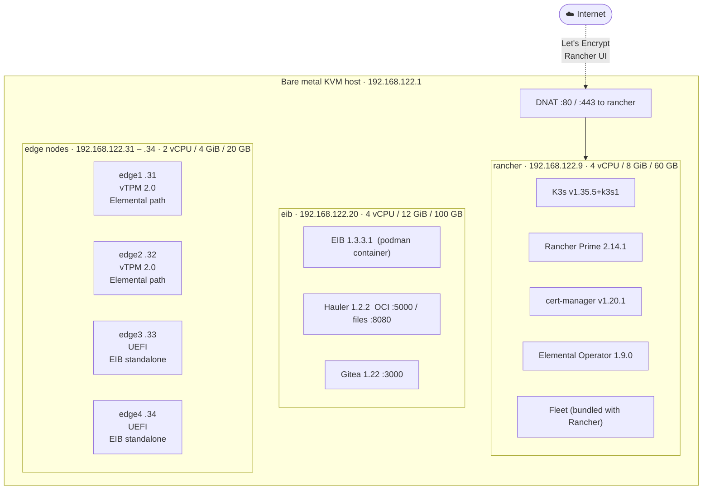
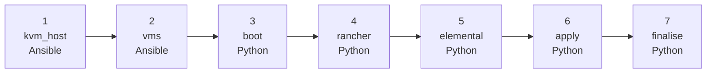

# Lab overview — infrastructure, architecture and deploy pipeline

This page explains the full picture: what infrastructure rodeo-cli builds, what each piece is for, and exactly what happens during `rodeo deploy`. Read it before the exercises to build a mental model, or after if something felt like magic.

---

## Lab topology

The lab runs entirely inside a single bare metal Linux host using nested KVM. All VMs share one NAT network (`virbr0`, `192.168.122.0/24`). The host routes traffic and DNATs ports 80 and 443 to the management VM so Let's Encrypt and the Rancher UI are reachable from outside.



---

## Virtual machines

| VM | IP | vCPU | RAM | Disk | Base OS |
|---|---|---|---|---|---|
| rancher | 192.168.122.9 | 4 | 8 GiB | 60 GB | openSUSE Leap 15.6 (cloud) |
| eib | 192.168.122.20 | 4 | 12 GiB | 100 GB | openSUSE Leap Micro 6.2 (cloud) |
| edge1 | 192.168.122.31 | 2 | 4 GiB | 20 GB | SL Micro 6.2 (built by students) |
| edge2 | 192.168.122.32 | 2 | 4 GiB | 20 GB | SL Micro 6.2 (built by students) |
| edge3 | 192.168.122.33 | 2 | 4 GiB | 20 GB | SL Micro 6.2 (built by students) |
| edge4 | 192.168.122.34 | 2 | 4 GiB | 20 GB | SL Micro 6.2 (built by students) |

Edge nodes are defined and their UEFI firmware is prepared at deploy time, but they are **not started**. Students start them after building OS images in Exercise 3. The DHCP static lease is set so the node always gets its fixed IP once it does boot.

MAC addresses all use the `0E` prefix (Edge profile convention):

| Node | MAC |
|---|---|
| rancher | `02:00:00:0E:62:E9` |
| eib | `02:00:00:0E:62:EB` |
| edge1–4 | `02:00:00:0E:62:A1` – `A4` |

---

## The two provisioning paths

Two approaches run in parallel through the lab, both valid production choices:

**Elemental path (edge1, edge2)**
EIB builds a minimal SL Micro ISO. The node boots from it, installs the OS to disk, and on first boot `elemental-register` contacts the Elemental Operator on the management cluster using its TPM identity. Rancher then provisions K3s remotely. The node never needs SSH access from an operator — it phones home and identifies itself.

**EIB standalone path (edge3, edge4)**
EIB builds a RAW disk image with K3s or RKE2 and all required container images baked in. The node boots from the image and is a running Kubernetes cluster with no registration step. This model suits fixed-function sites where the node's role is known at build time.

---

## The deploy pipeline — what rodeo-cli does

Running `rodeo deploy` executes seven phases in order. Each phase is idempotent — if it has already completed it is skipped on retry, so a failed deploy can be resumed from where it stopped.



---

### Phase 1 — kvm_host (Ansible, ~5 min)

Runs against the host itself to install and configure everything KVM needs.

**Packages installed:**
- KVM pattern: `qemu-kvm`, `libvirt`, `virt-manager`, `bridge-utils`
- Supporting tools: `swtpm` (virtual TPM emulator for edge nodes), `kubectl`, `cockpit`

**Kernel and network settings applied:**
- Nested virtualisation confirmed active (`/sys/module/kvm_intel/parameters/nested = Y`)
- IP forwarding enabled (`net.ipv4.ip_forward = 1`)
- Bridge-netfilter disabled (`bridge-nf-call-iptables = 0`) so the host firewall does not interfere with VM-to-VM traffic on virbr0
- ARP announcement restricted to each interface's own IPs (`arp_announce = 2`)

**Libvirt configured:**
- Modular daemons enabled (`virtqemud`, `virtnetworkd`, `virtstoraged`)
- Libvirt hook installed at `/etc/libvirt/hooks/qemu` to run DNAT rules when VMs start and stop
- The hook adds DNAT entries for port 80 and 443 when the rancher VM starts, and removes them when it stops

**Firewall:**
- firewalld installed but stopped and disabled until the boot phase. This avoids a race condition where firewalld interferes with cloud-init networking on the host before the libvirt network is ready.

**Cockpit:**
- `cockpit.socket` enabled and started. Instructors can reach the web console at `https://<host-ip>:9090` for a quick graphical view of VMs and host resources.

---

### Phase 2 — vms (Ansible, ~10 min)

Creates all disk images, cloud-init seeds, and libvirt domain definitions. The VMs are not started yet.

**SSH key:**
`/root/.ssh/id_ed25519` is generated if it does not exist. Its public key is baked into every VM's cloud-init user-data so all subsequent SSH steps work without passwords.

**Libvirt network:**
The `default` NAT network (`virbr0`, `192.168.122.0/24`) is defined and set to autostart. Static DHCP leases are added for every VM using its fixed MAC, so IPs are predictable from the moment any VM boots.

**rancher VM:**
1. Downloads the openSUSE Leap 15.6 cloud base image
2. Resizes it to 60 GB with `qemu-img resize`
3. Renders and packages a cloud-init seed ISO (NoCloud datasource) with:
   - User-data: `root` account, SSH authorised key, hostname `rancher`
   - Network-config: static IP `192.168.122.9` on the virbr0 bridge
4. Defines the libvirt domain with cloud-init ISO as a second CDROM

**eib VM:**
Same pattern but Leap Micro 6.2 base image, 100 GB disk, hostname `eib`, IP `192.168.122.20`. Cloud-init runs `podman pull` on the EIB container image at first boot.

**edge nodes:**
No disk image is created here. Students build OS images in Exercise 3 and rodeo-cli thin-clones them with `rodeo pull-edge-image` before each node boots. What IS created now: a copy of the OVMF UEFI variable store (`ovmf-x86_64-4m-vars.fd`) per edge node, so UEFI state is isolated per VM.

**All VMs** are defined in libvirt (`virsh list --all` shows them as `shut off`). The XML includes MAC addresses, vCPU/RAM from the resource definitions, OVMF firmware paths, and the swtpm socket path for edge nodes that have `tpm.enabled = true`.

---

### Phase 3 — boot (Python, ~2 min)

Brings the non-Harvester VMs online.

1. Starts firewalld and configures the `public` zone
2. Ensures the `default` libvirt network (virbr0) is active and set to autostart
3. Starts the `rancher` and `eib` VMs in order (edge nodes are intentionally left off)

After this phase, both VMs are booting and cloud-init is running on each. The next phase waits for SSH, so timing is not critical here.

---

### Phase 4 — rancher (Python, ~20 min)

Installs the full management stack on the rancher VM over SSH.

| Step | What happens |
|---|---|
| SSH wait | Polls until `root@192.168.122.9` is reachable (up to 5 min) |
| K3s install | Runs the K3s installer script for `v1.35.5+k3s1`; waits for the node to reach `Ready` |
| Helm install | Downloads and installs Helm 3 |
| cert-manager | `helm install` from the Jetstack OCI chart, version `v1.20.1`; waits for webhook pod |
| sslip.io hostname | Detects the host's external IP, sets `RANCHER_HOSTNAME=rancher.<ext-ip>.sslip.io` |
| Rancher Prime | `helm install` from SUSE OCI registry, version `2.14.1`, with `useBundledSystemChart=true` (keeps Rancher offline after deploy) and `ingress.tls.source=letsEncrypt`; waits for all Rancher pods |
| Rancher /ping wait | Polls `https://rancher.<ext-ip>.sslip.io/ping` until HTTP 200 (up to 10 min) |
| API config | Sets admin password from `~/.rodeo/secrets.yaml`, sets `server-url`, clears must-change-password flag |

The TLS certificate is issued by Let's Encrypt via the HTTP-01 ACME challenge. Traefik (bundled with K3s) handles the ingress. This is why port 80 DNAT was configured in the kvm_host phase.

---

### Phase 5 — elemental (Python, ~30 min total — Hauler pull is the bottleneck)

Installs Elemental, sets up Fleet GitOps, and populates the offline artifact stores on the EIB VM.

**5a. Elemental Operator**

Two Helm charts installed on the management cluster:
- `elemental-operator-crds-chart` v1.9.0 — the CRD definitions (`MachineRegistration`, `MachineInventory`, `ManagedOSImage`, etc.)
- `elemental-operator-chart` v1.9.0 — the operator pod in `cattle-elemental-system`

**5b. UI extension repos**

Two `ClusterRepo` resources added to Rancher so the Elemental UI extension and partner extensions appear in the Apps catalogue. This also dismisses the Rancher setup banner.

**5c. MachineRegistration**

Creates `suse-edge-reg-1` in `fleet-default` namespace. Key settings:
- `auth: tpm` — registration token is derived from the node's TPM, so a cloned disk on a different machine cannot re-register
- `powerOff: true` — node powers off after the OS install step, before the first-run reboot (prevents accidental double-registration)
- `machineInventoryLabels` — captures manufacturer and product name from DMI at registration time

**5d. Hauler store population**

Runs on the eib VM over SSH. This is the only step that pulls significant data from the internet.

| Artifact | Source | Size | Served as |
|---|---|---|---|
| `edge-image-builder:1.3.3.1` | `registry.suse.com` | ~800 MB | Hauler OCI :5000 |
| `elemental-register:1.9.0` | `registry.suse.com` | ~50 MB | Hauler OCI :5000 |
| `alien-geeko:latest` | `docker.io` | ~150 MB | Hauler OCI :5000 |
| SL Micro 6.2 SelfInstall ISO | `download.suse.com` | ~900 MB | Hauler files :8080 + `/home/eib-config/base-images/` |
| SL Micro 6.2 Default RAW | `download.suse.com` | ~2 GB | Hauler files :8080 + `/home/eib-config/base-images/` |

After storing the artifacts, `hauler-registry.service` and `hauler-fileserver.service` are enabled and started. The `99-k3s-registries.sh` combustion script is written to `/home/eib-config/scripts/`. This script will later be baked into every edge node image by EIB — it configures K3s to route all container pulls through Hauler.

**5e. Gitea deployment**

A `gitea/gitea:1.22-rootless` Podman container is started on the eib VM at port 3000. After the API is ready, two repositories are created:

- **`gitea/alien-geeko`** — mirrored from GitHub once at deploy time. Fleet polls this repo every 15 seconds to check for workload changes. No GitHub access is needed after deploy.

- **`gitea/eib-config`** — created locally and populated with git from templates generated by rodeo-cli. Contains:
  - Four node-specific EIB definition YAML files (one per edge node)
  - NMState network config templates for each node (pre-filled with fixed lab IPs)
  - Combustion scripts (`99-k3s-registries.sh`, hostname scripts for edge3/edge4)
  - An `elemental_config.yaml` placeholder that students overwrite in Exercise 2

Students clone this repo in Exercise 2 to get a ready-made EIB workspace at `/home/eib-workspace/`.

**5f. Fleet GitRepo**

Creates a `GitRepo` resource in `fleet-default` namespace pointing at `http://192.168.122.20:3000/gitea/alien-geeko.git`. The target selector matches any cluster with labels `demo=true` and `edge-type=x86-cluster`. When students label a cluster in Exercises 5 and 6, Fleet picks it up automatically.

---

### Phase 6 — apply (Python, instant unless manifests are present)

Walks subdirectories of the config dir for any `<hostname>/*.yaml` files and applies them to that VM with `kubectl apply -f -` over SSH. For the standard suse-edge workshop there are no such files, so this phase is a no-op. It exists for customisations — instructors can drop extra manifests here without modifying rodeo-cli.

---

### Phase 7 — finalise (Python, ~1 min)

- Enables `autostart` on all VMs in libvirt. If the host reboots, all VMs come back up automatically.
- Enables `libvirt-guests.service` so libvirt handles VM shutdown/resume on host power events.
- Prints the lab completion summary with the Rancher URL, SSH commands, and next steps.

---

## What exists when deploy finishes

By the time `rodeo deploy` returns, the host has:

| Resource | Location | Created by |
|---|---|---|
| libvirt `default` NAT network | virbr0 / 192.168.122.0/24 | vms phase |
| rancher VM (running) | 192.168.122.9 | vms / boot phases |
| eib VM (running) | 192.168.122.20 | vms / boot phases |
| edge1–4 VMs (off, defined) | 192.168.122.31–34 | vms phase |
| OVMF UEFI variable store per VM | `/var/lib/libvirt/images/*.fd` | vms phase |
| Host SSH key | `/root/.ssh/id_ed25519` | vms phase |
| DNAT rules (:80/:443 to rancher) | libvirt hook + firewalld | kvm_host / boot phases |
| K3s cluster | rancher VM | rancher phase |
| Rancher Prime 2.14.1 | rancher VM | rancher phase |
| cert-manager v1.20.1 | rancher VM | rancher phase |
| Let's Encrypt TLS cert | rancher VM | rancher phase |
| Elemental Operator 1.9.0 | rancher VM | elemental phase |
| MachineRegistration `suse-edge-reg-1` | rancher VM (`fleet-default` ns) | elemental phase |
| Fleet GitRepo `alien-geeko` | rancher VM (`fleet-default` ns) | elemental phase |
| Hauler store + services | eib VM (`/var/lib/hauler`) | elemental phase |
| EIB container pre-pulled | eib VM (Hauler OCI :5000) | elemental phase |
| SL Micro base images staged | eib VM (`/home/eib-config/base-images/`) | elemental phase |
| Gitea container (running) | eib VM (:3000) | elemental phase |
| Gitea repo `gitea/alien-geeko` | eib VM | elemental phase |
| Gitea repo `gitea/eib-config` | eib VM | elemental phase |
| Lab credentials | `~/.rodeo/secrets.yaml` on host | rodeo init |

---

## Lab credentials

All passwords are generated at `rodeo init` time and stored in `~/.rodeo/secrets.yaml` on the KVM host. Nothing is hardcoded anywhere.

```bash
cat ~/.rodeo/secrets.yaml
```

The relevant keys for this lab:

| Key | Used for |
|---|---|
| `rancher_admin_password` | Rancher UI and API |
| `gitea_admin_password` | Gitea admin user on eib VM |

---

## Further reading

- [Disconnected environment reference](disconnected-environment.md) — runtime data flows and offline design
- [Host setup](../instructor/host-setup.md) — install and deploy steps for instructors
- [Pre-lab checklist](../instructor/pre-lab-checklist.md) — verify everything before handing to students
- [rodeo-cli source](https://github.com/avaleror/rodeo-cli) — profiles, phases, and Ansible roles
